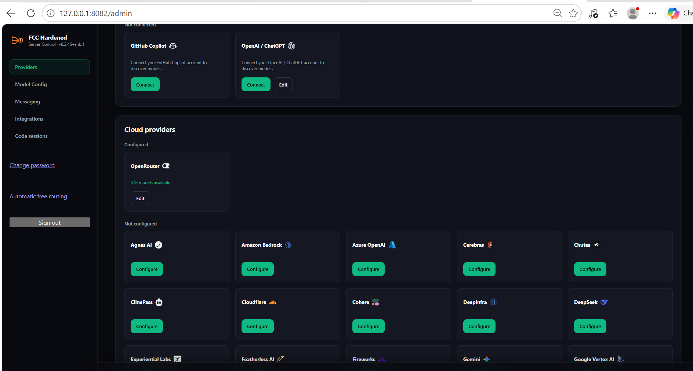
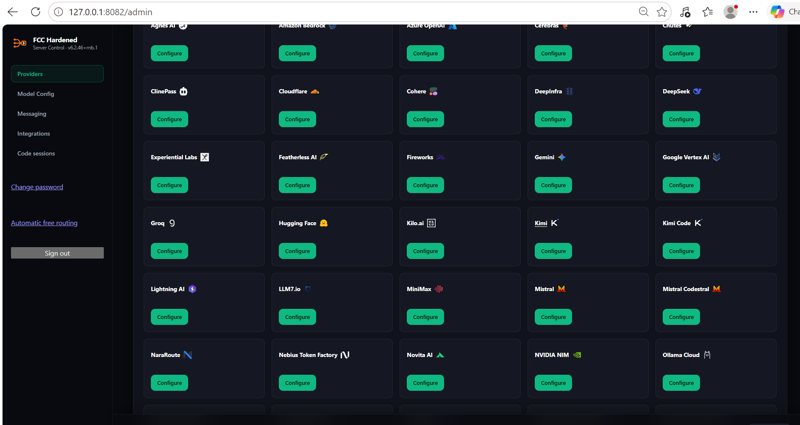
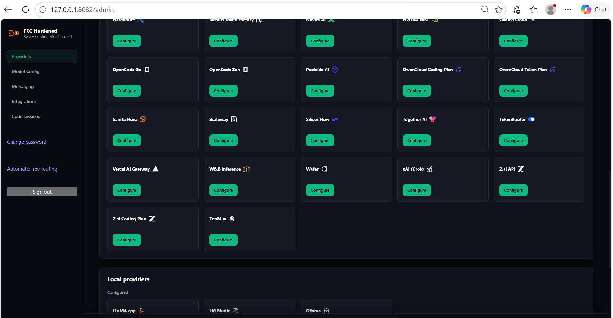
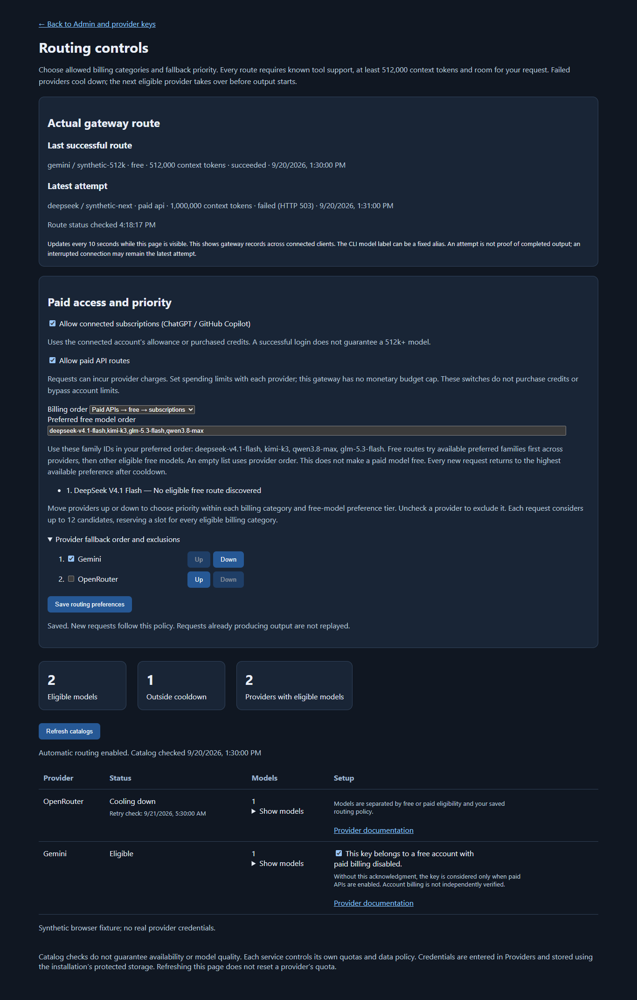

# Admin setup in pictures

Open the running app at <http://127.0.0.1:8082/admin>. For installation, launch commands and password recovery, see the [main README](../README.md#start-on-windows).

These three screenshots were supplied by the maintainer on **2026-09-20** and are included unchanged. They show the Providers page before the latest routing controls. Counts and configuration states are historical snapshots, not live availability or successful inference checks. Provider names and logos identify their respective services and do not imply endorsement.

## 1. Connections and configured providers

**Providers** contains account connections and API-key configuration. Use **Configure** to enter a provider's settings or **Edit** to update saved settings. Enter credentials only in the protected local Admin page.

The screenshot's **378 models available** is the OpenRouter provider catalog count. Automatic free routing applies additional pricing/account, tool-support, context and quota checks. Every selected model and fallback must have at least **512,000 context tokens** and enough room for the request; a catalog count does not establish any of those checks.

**OpenAI / ChatGPT** uses the connected-account flow. Enable **Allow connected subscriptions** in Routing controls to permit eligible subscription models. Connecting alone does not enable billing or add free capacity. A catalog with 272k default context is excluded by the 512k rule even when an experimental larger maximum is advertised.

## 2. More cloud-provider settings

**Gemini / Google account** now appears under **OAuth providers**. Choose **Edit** to save your own Google Desktop OAuth client ID, secret and Cloud project ID; then choose **Sign in with Google**. Enable **Allow paid API routes** to include it in automatic routing. Google API quotas/billing apply, and the 512k floor remains. See the [Google account setup guide](GOOGLE_ACCOUNT.md) for the required one-time Google configuration. The historical screenshots below predate this addition.

Scroll through the cloud providers to find the service whose credentials you want to configure. A visible card means a configuration interface exists; it does not mean that provider is configured, included in the automatic free pool, or currently offers a qualifying model.

For account-dependent free tiers, save the key, then open **Routing controls** in the sidebar. Confirm that the key belongs to a free account with paid billing disabled. The confirmation binds to that key and must be repeated after a key change. The app relies on this statement for account billing. Without it, these keys are used only as paid access when enabled.

## 3. Remaining cloud providers and local servers

The lower part of the page includes more cloud providers and the **Local providers** section. Local discovery uses an existing server and installed models; it does not download or load models for you. The same tool-support, context-capacity and request-fit checks apply to local automatic candidates.

## Check readiness and start coding

1. Save the settings for providers you intend to use.
2. Open **Routing controls** and complete required free-account confirmations. Optional switches permit subscriptions and paid APIs. Choose billing priority, move providers up/down, and uncheck unwanted providers; save preferences. Paid APIs may charge money and subscriptions may consume credits. Set limits with the provider; this gateway has no monetary budget cap.
3. Select **Refresh catalogs**. Review missing credentials, catalog failures, eligible models, context and cooldowns. Refreshing does not reset quota.
4. Launch Claude Code using `Claude-Free.ps1` from the repository, or invoke that launcher by its full path from your coding project. Automatic mode selects an eligible model without a manual model choice.

The **Actual gateway route** panel displays the provider/model that completed the last successful request and the latest attempt, with billing category and timestamps. It updates every ten seconds while visible. Records reset on restart and cover all connected clients. A pending attempt is not a successful response; a CLI header may remain a fixed alias.

This fourth image is a **synthetic browser test**, distinct from the three supplied screenshots. It illustrates the current controls and is not a record of the maintainer's provider credentials or live route.

Routing can have no available candidates even after a successful connection and catalog load. Eligibility is a catalog/account assessment, not proof of inference. If every eligible route is unavailable, the gateway returns an error and retains the selected billing policy and 512k minimum.

See [Automatic routing](../FREE_ROUTING.md) for provider and interface limits, [HARDENING.md](../HARDENING.md) for storage/access controls, and [VALIDATION.md](../VALIDATION.md) for dated checks.
